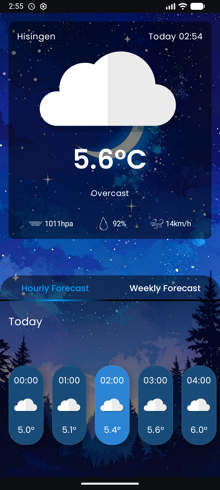
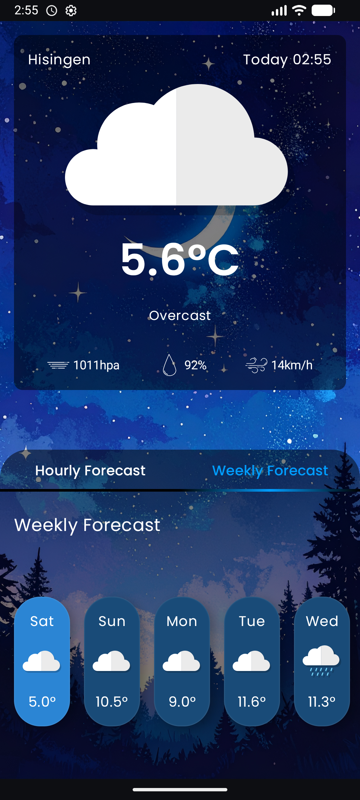

# Weather App

This is a modern weather application developed using Kotlin and Jetpack Compose. It offers users an easy way to check the weather and features a stylish design with the Poppins font.

## ✨ Features

- **Real-time Weather:** Get the current weather conditions for your location.
- **Weekly Forecast:** View the weather forecast for the upcoming week.
- **Modern UI:** A clean, simple, and reactive user interface built with Jetpack Compose.

## 🛠️ Technologies Used

- **Language:** [Kotlin](https://kotlinlang.org/)
- **UI:** [Jetpack Compose](https://developer.android.com/jetpack/compose) - A modern declarative UI toolkit for Android.
- **Architecture:** MVVM (Model-View-ViewModel) with Clean Architecture principles.
- **Asynchronous Programming:** Coroutines & Flow
- **Dependency Injection:** [Hilt](https://developer.android.com/training/dependency-injection/hilt-android) - A dependency injection library for Android.
- **Networking:** [Retrofit](https://square.github.io/retrofit/) for network requests and [Moshi](https://github.com/square/moshi) for JSON parsing.
- **Static Code Analysis:** [Detekt](https://detekt.dev/) - To improve code quality.

## 📸 Screenshots

  
  &nbsp; &nbsp; &nbsp;
  

